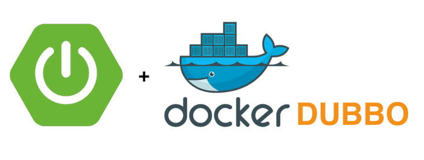
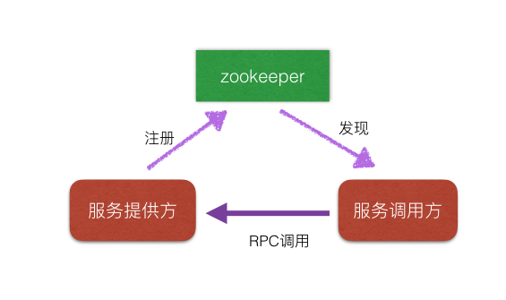
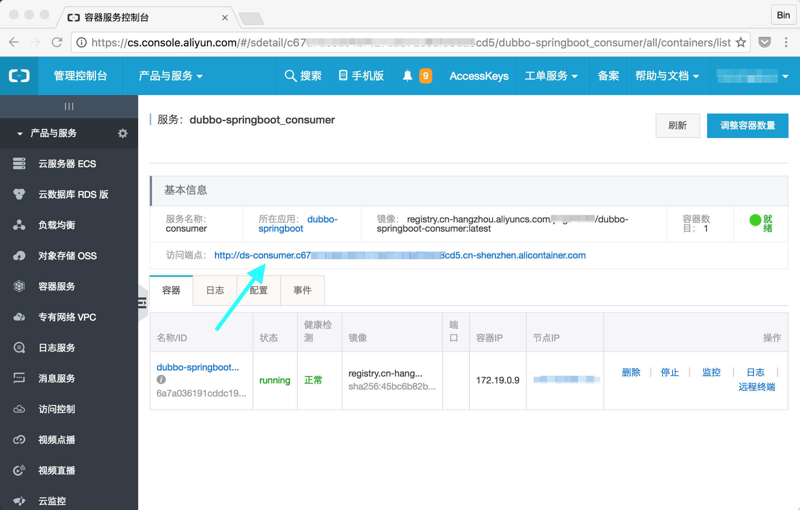
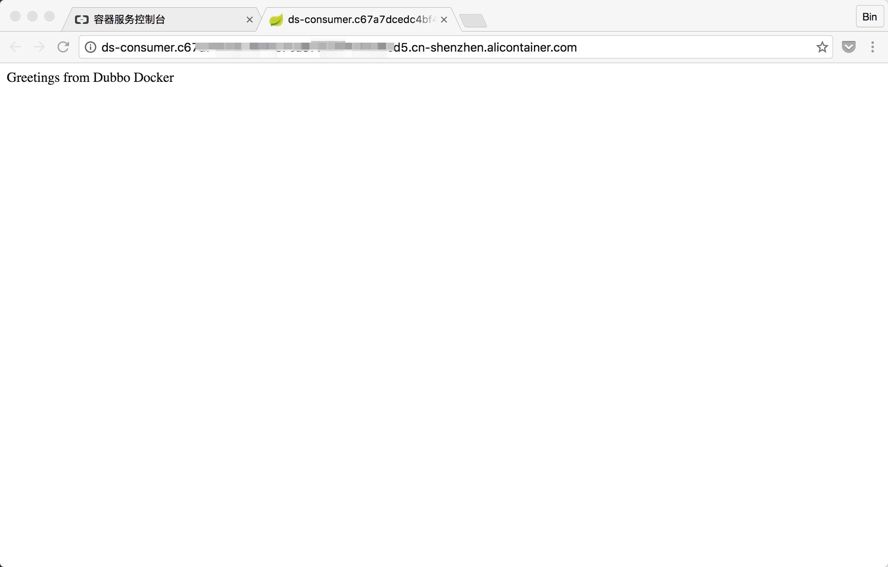

# 在Docker中运行Dubbo应用



Dubbo是阿里开源的一个分布式服务框架，在国内粉丝很多。[官网](http://dubbo.io)上的介绍是：

>DUBBO是一个分布式服务框架，致力于提供高性能和透明化的RPC远程服务调用方案，是阿里巴巴SOA服务化治理方案的核心框架，每天为2,000+个服务提供3,000,000,000+次访问量支持，并被广泛应用于阿里巴巴集团的各成员站点。
>

Dubbo的文档很完整，网络上资源也很多，这里就不再重复了。本文做这样一个尝试，将一个Dubbo应用容器化，部署到阿里云的容器服务上。

## 极简Dubbo应用结构

在Dubbo世界里，服务调用方和服务提供方通过Dubbo的发现机制互相发现。一个最小的Dubbo应用包含如下三个服务：

- 服务提供者
- 服务调用方
- 发现机制（例如zookeeper）



zookeeper已经有Docker镜像了，下面我们就会用[Spring Boot](https://projects.spring.io/spring-boot/)开发服务提供方Service Producer和服务调用方Service Consumer。

## 定义服务接口

创建一个Maven模块service-api，定义服务接口。

```java
public interface Greetings {
    String say(String name);
}
```
这个接口很简单，就是问好。

在pom.xml中引入对Dubbo的依赖：

```xml
<dependencies>
    <dependency>
        <groupId>com.alibaba</groupId>
        <artifactId>dubbo</artifactId>
        <version>2.5.3</version>
    </dependency>
</dependencies>
```
我们用的是dubbo 2.5.3版本，读者如果愿意尝试更新的版本，可以自行升级。

## 服务提供方 Service Producer

创建一个Maven模块service-producer，提供服务接口的实现。

```java
public class GreetingsImpl implements Greetings {
    public String say(String name) {
        return "Greetings from " + name;
    }
}
```

为了能找到服务接口模块，需要在pom.xml中定义对service-api的依赖。

```xml
<dependencies>
    ...
    <dependency>
        <groupId>com.example</groupId>
        <artifactId>dubbo-service-api</artifactId>
        <version>1.0-SNAPSHOT</version>
    </dependency>

```

Dubbo通过spring xml配置文件的方式声明对zookeeper的访问。在resources目录下创建services.xml，其中最重要的内容是指定zookeeper的地址和端口，为了不把zookeeper的地址写死在配置文件中，我们采用环境变量来指明服务地址。这也是[12 factor](https://12factor.net/)应用的一个推荐实践之一。

```xml
<dubbo:registry protocol="zookeeper" address="${ZOOKEEPER_SERVER}:2181" />

<dubbo:protocol name="dubbo" port="20880" />

<dubbo:service interface="com.example.service.Greetings" ref="greetingService"/>

<bean id="greetingService" class="com.example.service.producer.GreetingsImpl" />
```
xml文件中的其他内容包括指定本服务的侦听端口为```20880```，```GreetingsImpl```类实现的接口API类等。

下面要在pom.xml引入dubbo的项目依赖。

```xml
<dependencies>
    ...
    <dependency>
        <groupId>com.alibaba</groupId>
        <artifactId>dubbo</artifactId>
        <version>2.5.3</version>
		<exclusions>
            <exclusion>
                <artifactId>spring</artifactId>
                <groupId>org.springframework</groupId>
            </exclusion>
        </exclusions>
    </dependency>
    <dependency>
        <groupId>com.github.sgroschupf</groupId>
        <artifactId>zkclient</artifactId>
        <version>0.1</version>
    </dependency>

```

我们准备用spring 4.x，所以把dubbo中自带的老版本springframework剔除。

现在服务的实现类有了，我们需要一个主函数把实现类运行起来。Springboot有一个很好的特性，就是把一个Java应用的所有相关依赖打包成为一个超级JAR包，对于生成Docker镜像来说非常方便。

首先在pom.xml中引入springboot依赖。

```xml
<dependencies>
	<dependency>
		<groupId>org.springframework.boot</groupId>
		<artifactId>spring-boot-starter-web</artifactId>
	</dependency>
...

```

创建一个Spring主应用。由于Dubbo采用xml配置文件的方式，要通过```@ImportResource```声明加载services.xml配置文件。

```java
@SpringBootApplication
@ImportResource({"classpath:services.xml"})
public class Application {
    public static void main(String[] args) throws Exception{
        SpringApplication.run(Application.class, args);
    }
}
```

Springboot Web应用启动后会自动侦听8080端口。不过我们在这里没有用到内置的tomcat和8080端口。如果你不喜欢这个多余的tomcat，可以用```spring-boot-starter```替换本文中的```spring-boot-starter-web```项目，但要注意的是，没有tomcat的代码需要增加不退出应用的逻辑。

## 服务调用方 Service Consumer

Service Consumer的结构和Producer的结构类似，也需要在pom.xml中引入对dubbo, service-api和springboot的依赖。在resouces目录下创建services.xml，声明zookeeper的地址和要访问的服务接口：

```xml
<dubbo:registry protocol="zookeeper" address="${ZOOKEEPER_SERVER}:2181" />
<dubbo:reference id="greetingService" interface="com.example.service.Greetings" />

```
远程调用的服务bean名字为```greetingService```，在下面的代码中要用到。

在Application主应用中调用Service Producer。

```java
Greetings greetingService = (Greetings)context.getBean("greetingService");
String result = greetingService.say("Dubbo Docker");
```

为了能够用HTTP访问Consumer应用，我们用```@RequestMapping```将context root ／映射到方法上。

```
@RequestMapping("/")
public String greetings(){
   ...
```

Consumer启动侦听的端口在resources/application.properties文件中指定：

```
server.port=${SERVER_PORT:0}
```

## 编译并在本地运行

在项目的根目录下运行Maven编译：

```
mvn package
```

从Docker镜像中启动zookeeper，并把2181端口映射到本机：

```
docker run -d -p 2181:2181 -p 2888:2888 -p 3888:3888 registry.aliyuncs.com/acs-sample/zookeeper:3.4.8
```

在环境变量中指定zookeeper地址，启动Service Producer。

```
export ZOOKEEPER_SERVER=127.0.0.1
java -jar target/dubbo-service-producer-1.0-SNAPSHOT.jar
```

启动Service Consumer时除了要指定zookeeper地址外，还要指定consumer自己侦听的地址，本示例中使用的是8899。

```
export ZOOKEEPER_SERVER=127.0.0.1
export SERVER_PORT=8899
java -jar target/dubbo-service-consumer-1.0-SNAPSHOT.jar
```

访问一下cosumer的HTTP 8899端口，可以看到消息的输出。说明服务调用方从zookeeper中获得了正确的producer的地址，并用dubbo远程调用协议成功调用了producer的GreetingService。

```
$curl http://localhost:8899/
Greetings from Dubbo Docker
```

## 构建Docker镜像

为Producer和Consumer构建Docker镜像和正常的SpringBoot应用一样，Dockerfile内容如下：

```
FROM openjdk:8-jre
VOLUME /tmp
COPY target/*.jar app.jar
RUN sh -c 'touch /app.jar'
CMD ["java","-Djava.security.egd=file:/dev/./urandom","-jar","/app.jar"]
```

把这个文件分别放在Producer和Consumer的目录下，执行Docker的编译命令即可打包生成容器镜像。

在service-producer目录下运行：

```
mvn package
docker build -t producer .
```

生成service-consumer镜像类似，这里就不重复了。

两个镜像生成后，可以用Docker Compose命令启动。对应的docker-compose.yml内容如下：

```yaml
version: "2"
services:
  zookeeper:
    image: 'registry.aliyuncs.com/acs-sample/zookeeper:3.4.8'
    hostname: zookeeper
  producer:
    image: 'producer:latest'
    environment:
      - ZOOKEEPER_SERVER=zookeeper
  consumer:
    image: 'consumer:latest'
    environment:
      - ZOOKEEPER_SERVER=zookeeper
      - SERVER_PORT=8899
    ports:
      - 8899:8899

```

在这里把zookeeper容器的主机名hostname设置为```zookeeper```并通过环境变量传给producer和consumer。运行Docker Compose启动三个容器。

```
$docker-compose up -d
Creating docker_consumer_1
Creating docker_zookeeper_1
Creating docker_producer_1
```

容器启动成功后用同样方式访问8899端口可以看到正确的输出。

```
$curl http://localhost:8899/
Greetings from Dubbo Docker
```

## 部署到阿里云容器上

好了，至此我们已经成功地在本地Docker环境中运行了Dubbo应用，下面就要将这个应用部署到阿里云容器服务上。

首先登陆阿里云Docker镜像仓库，地址在此[https://cr.console.aliyun.com/](https://cr.console.aliyun.com/)，创建2个镜像仓库。在本示例中命名为```dubbo-springboot-producer```和```dubbo-springboot-consumer```。

创建一个为阿里云部署的模版文件，docker-compose-acs.yml，内容和docker-compose.yml类似。

```yaml
version: "2"
services:
  zookeeper:
    image: 'registry.aliyuncs.com/acs-sample/zookeeper:3.4.8'
    hostname: zookeeper
  producer:
    image: 'registry.cn-hangzhou.aliyuncs.com/${rname}/dubbo-springboot-producer:latest'
    environment:
      - ZOOKEEPER_SERVER=zookeeper
  consumer:
    image: 'registry.cn-hangzhou.aliyuncs.com/${rname}/dubbo-springboot-consumer:latest'
    environment:
      - ZOOKEEPER_SERVER=zookeeper
      - SERVER_PORT=8899
    labels:
      aliyun.routing.port_8899: http://ds-consumer

```

这个部署文件和docker-compose.yml内容不同之处在于，所有容器到主机端口映射都去掉了，为了能访问consumer，使用了```aliyun.routing.port_8899```为consumer指定一个子域名。集群部署后可用如下URL访问consumer服务。

```
http://ds-consumer.c67***8cd5.cn-shenzhen.alicontainer.com
```

登陆阿里云容器服务控制台 [https://cs.console.aliyun.com](https://cs.console.aliyun.com)，利用部署模版创建一个新应用，部署模版的内容就是上面docker-compose-acs.yml内容，提示```rname```时输入你的容器仓库用户名，很快应用部署就会成功。

在控制台中进入consumer服务页面，找到访问端点：



点击地址，可以在浏览器中看到输出：



至此，我们成功地在云上运行了Dubbo应用。

## 讨论

在网上有讨论容器化的Dubbo应用发送的IP地址不对，经实测在Docker 1.12版本下没有这个问题，部署到阿里云容器服务上也正常。本文的示例代码在[github](https://github.com/binblee/dubbo-docker)上，大家可以参考。

## 小节
本文通过Spring Boot构建了一个最小的Dubbo应用，容器化后成功部署到阿里云容器服务上。
